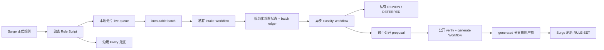

# Surge 兜底规则自动学习计划（安全审计修订版）

> 修订日期：2026-07-21
> 状态：架构可行，但必须完成本文标记的安全边界与可靠性修订后，才能启用无人值守发布。

## 1. 审计结论

方案可以实现，推荐采用以下职责分离：

1. **Surge 只负责低成本采集和可靠投递。**
2. **私有 inbox 只负责接收入库、聚合观察、分类和保存 REVIEW。**
3. **公开仓库只接收已经准备公开的最小规则提案，并独立复验后生成产物。**
4. **接收入库与分类、发布彻底解耦。** 手机只等待私有入库成功，不等待上游下载、分类或公开发布完成。
5. **第一版自动化采用非对称风险策略。** PROXY 可以在高置信度下自动发布；DIRECT 默认只进入 REVIEW，除非存在人工 override 或更强证据。

综合判断：

| 项目 | 结论 | 说明 |
|---|---|---|
| 总体可实现性 | 高 | Surge Rule Script、Cron、Event、持久存储和 GitHub Workflow Dispatch 均可支撑链路 |
| GitHub 端确定性 | 高 | 固定代码、固定来源锁、语义验证和幂等提交可以做到可复现 |
| Surge 端严格零遗漏 | 中低 | `$persistentStore` 没有公开的事务或原子更新保证 |
| 自动生成 PROXY 规则 | 中高 | 错误代价主要是性能和可用性，可通过证据门槛控制 |
| 自动生成 DIRECT 规则 | 中低 | 错误 DIRECT 可能造成流量泄露、访问失败或绕过代理，必须使用更高门槛 |
| 自动扩大父级 suffix | 中 | 必须经过 PSL、多租户 denylist、反向规则和 dry-run 审查 |

## 2. 原方案中必须修复的问题

### 2.1 高优先级问题

| 问题 | 风险 | 修订 |
|---|---|---|
| 手机等待“分类并公开发布完成”后才删除 batch | 外部来源失败或公开 Workflow 失败会让手机长期重试；私有 Runner 轮询会浪费分钟 | 手机只等待私有 inbox **持久化成功**；分类和发布由后续 Workflow 异步处理 |
| 原始 batch 写入 Git 历史 | 域名可能长期留在不可轻易清除的私有 Git 历史中，仓库也会持续膨胀 | 不提交原始 payload；只提交规范化、分片后的观察状态和 batch 哈希账本 |
| `days`、`count` 由手机上传 | 字段可伪造；并且与“同一目标每天只持久写一次”矛盾 | V1 payload 移除 `days` 和 `count`；服务端按实际接收日期聚合 `seen_days` |
| 上游每次从浮动分支解析最新 commit | 结果不可复现，且上游被接管时可能立即污染分类 | 分类只使用已审核的 `sources.lock.json`；来源更新由独立 Workflow 创建 PR，不自动改锁 |
| 手机 PAT 的 `Actions: write` 被描述成“仅能 dispatch” | 该权限还可取消、重跑、启停 Workflow，并读取 Actions 数据 | inbox 必须是专用仓库；只允许一个对手机开放的 intake Workflow；不得放置可被输入直接利用的其他特权 Workflow |
| 未保护 GitHub、规则源和上传请求自身 | 自动规则可能改变控制面路由，造成递归捕获或自我失联 | 增加不可学习的 control-plane allowlist，并为上传请求指定固定策略 |

### 2.2 中优先级问题

1. `403` 不一定代表 token 失效，也可能是主速率限制、次级速率限制或滥用保护。必须结合 `Retry-After`、`X-RateLimit-Remaining` 和响应消息判断。
2. 应用层 schema 错误通常发生在 Workflow 内，不会直接表现为 dispatch API 的 `422`。`422` 更常见于 ref、Workflow 状态或输入定义错误。
3. 仅使用 `JSON.parse` 无法发现重复 JSON key。若保留对象型 wire schema，需要严格 JSON 解析器；更简单的做法是使用固定长度的数组型 schema。
4. 只在只读 job 验证一次不足以形成权限边界。拥有 `contents: write` 的 persist/publish job 必须重新读取并重新验证输入，不能盲目信任 job output。
5. 上游临时失败不应归入人工 `REVIEW`，否则会制造大量无意义工单。应增加 `DEFERRED` 状态。
6. `ubuntu-24.04` 仍会滚动更新。应固定 Node 主版本或精确版本，并记录生成环境。

## 3. 第一性原理与信任边界

系统解决五个问题：

1. **采集**：识别确实落到兜底位置的目标。
2. **接收入库**：可靠、幂等地把观察事实送入私有仓库。
3. **分类**：用可审计证据判断 PROXY、DIRECT、IGNORE、REVIEW 或 DEFERRED。
4. **作用域**：判断规则应使用精确 `DOMAIN`、安全 `DOMAIN-SUFFIX`，还是不自动发布。
5. **发布**：生成无重复、无未声明冲突、可验证和可回滚的 Surge 规则。

必须保持以下边界：

- **观察事实不等于规则结论。** 兜底命中只证明“当前配置没有更早匹配”，不证明应该 DIRECT 或 PROXY。
- **入库成功不等于分类成功。** 上游故障不能阻止手机清理已安全持久化的 batch。
- **分类成功不等于发布成功。** 公开仓库必须独立复验。
- **PSL 边界不等于业务作用域。** PSL 只说明注册边界，不能证明整个注册域应使用同一策略。
- **错误 DIRECT 的风险高于错误 PROXY。** 两类策略不能使用完全相同的自动发布门槛。

## 4. 推荐架构



### 4.1 仓库和分支职责

| 位置 | 可见性 | 保存内容 | 写入者 |
|---|---|---|---|
| `Surge-Rule-Inbox` | Private | 观察状态、REVIEW、DEFERRED、私有决定、batch 哈希 | 私有 Workflow 的 `GITHUB_TOKEN` |
| 公开 Surge 仓库 `main` | Public | 分类器、生成器、测试、人工 source、来源锁 | 人工 PR；自动发布不得写入 |
| 公开 Surge 仓库 `generated` | Public | `Rule/Direct+.list`、`Rule/Proxy+.list`、自动 source、manifest | publish Workflow |

推荐把生成产物写入独立 `generated` 分支，而不是让自动化直接修改 `main`：

1. `main` ruleset 禁止 `github-actions[bot]` 直接更新。
2. `generated` 分支只保存数据产物，不保存 Workflow 和可执行代码。
3. Surge 的远程规则 URL 指向 `generated` 分支。
4. publish Workflow 从受保护的 `main` 读取代码和人工配置，再更新 `generated`。

若不使用独立分支，最低要求是 publish 脚本在提交前验证允许路径，并确保主分支 ruleset 不允许 Workflow 绕过保护；但该方案仍弱于代码与产物分支隔离。

### 4.2 手机凭据的真实权限边界

Fine-grained PAT：

```text
Repository: Surge-Rule-Inbox only
Permission: Actions write
Expiration: 90 days or less
```

GitHub 当前的 Workflow Dispatch API 要求 Fine-grained token 具有仓库 `Actions: write`。该权限不是“只能触发单个 Workflow”，还覆盖部分 Actions 管理能力。因此：

1. inbox 必须是专用仓库。
2. 只有 intake Workflow 暴露 `workflow_dispatch`。
3. 分类 Workflow 使用 `workflow_run` 或 `schedule`，不暴露手机可控的 dispatch 输入。
4. inbox 不保存无关 Actions secrets。
5. 跨仓库发布优先使用仅安装在公开仓库的 GitHub App 短期 installation token；若使用 PAT，必须只授予公开仓库 `Actions: write` 并缩短有效期。
6. 所有 Workflow 都必须对重复运行幂等，因为泄露的手机 token 可以重跑、取消或制造排队 DoS。

## 5. Surge 端设计

### 5.1 采集位置

在所有正式规则之后、`FINAL` 之前加入：

```ini
SCRIPT,fallback-capture,Proxy
FINAL,Proxy,dns-failed
```

脚本返回：

```js
$done({ matched: true });
```

Surge Rule Script 通过 `$request.hostname` 等参数判断是否命中；默认不会触发 DNS 查询。规则按主配置顺序匹配，因此兜底 SCRIPT 必须明确放在主 `[Rule]` 的末端，不能依赖模块插入顺序。

### 5.2 控制面保护

以下目标永远不得由自动学习覆盖或改变策略：

- `api.github.com`
- `github.com`
- `raw.githubusercontent.com`
- GitHub App token API 所需域名
- 所有锁定上游来源 host
- Surge 规则文件实际托管 host
- 用户手工指定的上传代理或健康检查域名

要求：

1. 在兜底 SCRIPT 之前写入显式 control-plane 规则。
2. capture 脚本对这些域名直接忽略。
3. `$httpClient` 上传请求显式指定固定 `policy`，不依赖正在学习的兜底策略。
4. 上传脚本设置 `auto-cookie: false`、`auto-redirect: false`、短超时并保持 TLS 校验开启。

### 5.3 热路径性能

1. `engine=jsc`，`timeout=1`。
2. 热路径不做 HTTP、DNS、GeoIP、ASN、PSL 或上游查询。
3. 仅处理 `$request.hostname`，执行小写、去尾点、长度和字符检查。
4. 使用 16 或 32 个固定 shard；FNV-1a 只用于选择 shard，不承担安全用途。
5. 同一目标同一天只持久写一次。
6. V1 不记录精确重复次数，避免每次命中都读改写持久存储。
7. 忽略单标签主机、`.local`、`home.arpa`、私网、环回、链路本地、组播和无效地址。
8. 高熵或疑似租户标签默认禁止公开自动发布，例如 UUID、长十六进制、长 Base32/Base64URL 风格标签。

### 5.4 本地队列

状态分为：

- `live shards`：继续接收新观察。
- `inflight batches`：不可变，等待 dispatch 或确认入库。
- `dead-letter`：本地格式损坏或服务端明确拒绝的 batch。

约束：

1. 每批最多 256 个目标。
2. 按最终 HTTP 请求体的 UTF-8 大小切分，不只按内层 JSON 字符数估算。
3. 建议内层 payload 控制在 24–32 KiB，给外层 JSON 转义和未来字段留余量。
4. 设置总本地容量上限，例如 2 MiB 或 30 个 inflight batch；达到上限后停止新增低优先级目标并通知用户，不能静默覆盖 inflight。
5. 上传回调只能删除对应 immutable batch，不能覆盖上传期间产生的新 live 数据。

### 5.5 最小 wire schema

V1 不上传 `days`、`count`、设备 ID、URL、路径、查询参数、请求头、进程、源 IP 或精确时间。

推荐使用数组型 JSON，避免重复 key 歧义并减少体积：

```json
[
  1,
  "20260721-0003-a1b2c3d4",
  "2026-07-21",
  [
    ["d", "example.com"],
    ["4", "203.0.113.5"],
    ["6", "2001:db8::1"]
  ]
]
```

字段含义：

1. schema version。
2. batch ID。只要求稳定唯一，不作为秘密或认证因子。
3. 设备日期，仅作诊断；分类日期以服务端接收日期为准。
4. 目标元组：`d`、`4`、`6`。

服务端计算：

- `transport_sha256`：对收到的原始 payload 字符串计算，用于绑定 batch ID。
- `semantic_sha256`：对服务端规范化后的语义内容计算，用于去重和提案 ID。

### 5.6 上传与确认

使用：

```text
POST /repos/{owner}/{repo}/actions/workflows/intake-fallback.yml/dispatches
Accept: application/vnd.github+json
Authorization: Bearer <token>
X-GitHub-Api-Version: 2026-03-10
User-Agent: Surge-Fallback-Learner/1
```

当前 API 版本成功时返回 HTTP `200`，并包含 `workflow_run_id`、`run_url` 和 `html_url`。设备保存 run ID 并轮询私有 intake run。

**删除本地 batch 的唯一条件：私有 intake run 为 `completed/success`。**

此时只要求：

1. schema 已严格校验。
2. batch ID 与 payload hash 已绑定。
3. 规范化观察状态已持久化到私有仓库。
4. REVIEW 或待分类状态不会因后续失败而丢失。

不要求分类或公开发布已经完成。

### 5.7 HTTP 状态处理

| 状态 | 处理 |
|---|---|
| 200 | 保存 `workflow_run_id`，轮询 intake run |
| 401 | token 无效，停止自动重试并通知 |
| 403 + `Retry-After` 或 rate limit 耗尽 | 按服务端时间退避，不判定 token 失效 |
| 403 且非限流 | 权限、SSO 或策略错误，停止自动重试并通知 |
| 404 | 可能是仓库/Workflow 错误，也可能是权限被隐藏；检查配置和 token |
| 422 | dispatch 请求本身无效，例如 ref、Workflow 状态或输入定义错误；隔离并通知 |
| 429、5xx、网络错误 | 指数退避并加入随机抖动，保留 immutable batch |

应用层 schema 错误通过 intake run 的失败结论处理，而不是依赖 dispatch API 返回 `422`。

### 5.8 Cron 与网络变化

1. 02:00 尝试旋转并上传。
2. `network-changed` 只负责触发“检查是否有到期重试”，不直接无条件上传。
3. 使用 `next_retry_at`、指数退避和带过期时间的单飞锁。
4. 单飞锁只能视为最佳努力，因为持久存储没有公开原子保证。
5. 提供手工触发脚本，用于锁屏、系统调度未执行或长期离线后的补偿。

## 6. 私有 inbox 设计

### 6.1 不保存原始 batch

intake Workflow 验证完成后：

1. 不把原始 dispatch payload 写入日志、artifact、cache 或 Git。
2. 按规范化目标更新固定数量的观察 shard，例如 `Inbox/observations/00.json` 到 `ff.json`。
3. 每个目标只保存必要信息：

```json
{
  "value": "example.com",
  "type": "domain",
  "first_seen": "2026-07-21",
  "last_seen": "2026-07-21",
  "seen_days": 1,
  "status": "pending"
}
```

4. batch ledger 只保存：batch ID、transport hash、接收日期和处理结果。
5. 仓库 Actions 日志保留期设置为可接受的最低值，并禁止上传 raw artifact。

### 6.2 intake Workflow

建议结构：

1. 仅 `workflow_dispatch`。
2. 顶层 `permissions: {}`。
3. validate job：`contents: read`，从 `$GITHUB_EVENT_PATH` 读取，不把 payload 插值到 shell、run-name、matrix、job-name 或环境变量。
4. persist job：`contents: write`，重新执行完整校验，再更新固定 shard 和 ledger。
5. 两个 job 之间只传递 hash、数量和布尔结果，不传原始目标。
6. `timeout-minutes` 设为 5 或更低。
7. 使用固定 concurrency group 和 `queue: max`；算法不得依赖 dispatch 顺序，因为排队顺序并不等于分发顺序。

### 6.3 分类 Workflow

由 intake 完成后的 `workflow_run` 或定时任务触发，不接收手机提供的分类参数。

分类 Workflow：

1. 只读取已持久化的规范化状态。
2. 使用公开仓库**固定 commit SHA**的分类器。
3. 使用已审核的 `sources.lock.json`，不在分类时追踪浮动分支。
4. 临时上游失败标记为 `DEFERRED`，不进入人工 `REVIEW`。
5. 只有准备公开的最小 proposal 才发送到公开仓库。
6. REVIEW、DEFERRED、观察日期和频率不离开私有仓库。

## 7. 分类策略

### 7.1 证据顺序

1. 实际生效 profile 中已有 Direct、Proxy、Reject、SYSTEM、LAN 和内联规则的语义覆盖。
2. 人工 override。
3. 已审核锁定的可信上游规则。
4. 多个服务端接收日期，只用于置信度和 suffix 建议，不能单独证明路由策略。

### 7.2 非对称自动发布门槛

#### PROXY

可自动进入作用域判断的最低条件：

- 两个独立根数据家族同意，反向证据为 0；或
- 一个明确权威来源以精确规则或 suffix 明确覆盖，并在至少两个服务端日期出现；
- 不存在 Reject、Direct 或人工冲突；
- 不属于 control-plane、多租户或高熵目标。

#### DIRECT

V1 推荐默认只进入 REVIEW。只有以下情况可自动：

- 人工 override 明确指定 DIRECT 和作用域；或
- 至少两个独立 Direct 根数据家族一致，至少三个服务端日期出现，Proxy/Reject 证据为 0，并通过额外隐私和泄露风险审查。

#### IP

V1 的公网 IPv4/IPv6 自动发布关闭，全部进入 REVIEW。IP 可能是共享、临时或 CDN 地址；只有人工决定或权威来源明确 CIDR 时才发布。

### 7.3 分类状态

| 状态 | 含义 |
|---|---|
| `EXISTS` | 已被同策略规则覆盖 |
| `PROPOSE_PROXY` | 满足 PROXY 提案条件 |
| `PROPOSE_DIRECT` | 满足高门槛 DIRECT 条件 |
| `IGNORE` | 不应发布或属于敏感目标 |
| `REVIEW` | 证据冲突、范围不明或需要人工判断 |
| `DEFERRED` | 上游不可用、锁不匹配或系统故障，稍后自动重试 |

### 7.4 上游供应链

分类只使用锁文件中的来源：

```json
{
  "source_id": "example-proxy",
  "family_id": "gfw-root-a",
  "repo": "owner/repo",
  "commit": "full-40-char-sha",
  "content_sha256": "...",
  "license": "...",
  "allowed_rule_types": ["DOMAIN", "DOMAIN-SUFFIX"],
  "allowed_policies": ["PROXY"],
  "max_bytes": 5000000,
  "max_entry_delta_ratio": 0.15
}
```

规则：

1. 分类时禁止解析 `main`、`master` 或其他浮动 ref。
2. 独立 source-update Workflow 检查新版本、差异、许可证、大小和语法，并创建 PR 更新 lock。
3. 只允许 HTTPS 和固定 host allowlist。
4. Node `fetch` 使用 `redirect: "manual"`；若允许重定向，逐跳重新检查 host。
5. 校验响应大小、超时、内容 hash、语法和条目数量变化。
6. 镜像、派生和包含关系按 `family_id` 去重，不能重复计票。
7. 来源故障 fail closed，但状态为 `DEFERRED`，而非自动生成规则。

## 8. suffix-first 作用域生成

### 8.1 核心原则

尽量使用 `DOMAIN-SUFFIX`，但只有证据明确支持整个范围时才扩大。`DOMAIN` 是共享设施、精确例外和范围不确定时的安全退路。

### 8.2 自动选择顺序

1. 人工 override 明确指定并通过冲突检查的 suffix。
2. 锁定上游明确提供 `DOMAIN-SUFFIX`，选择最小且安全的上游范围。
3. 观察式父域聚合只生成 REVIEW 建议；V1 不自动写入。
4. 上游只提供精确 `DOMAIN` 时，保留精确规则。
5. 无法证明范围时进入 REVIEW。

### 8.3 suffix 安全门

任何自动 `DOMAIN-SUFFIX,s` 必须满足：

1. `s` 是有效 ASCII 域名，不能等于 ICANN 或 PRIVATE public suffix。
2. `s` 只能是候选 eTLD+1 或更深层 suffix。
3. `s` 不在共享 CDN、对象存储、云函数、Pages、动态 DNS、多租户和用户自定义 denylist。
4. Direct、Proxy、Reject、SYSTEM、LAN、模块规则和内联规则中没有未声明的反向父项、同项或子项。
5. 没有反向 `DOMAIN-KEYWORD` 覆盖。
6. 不包含疑似租户 ID、UUID、账户名或高熵标签的自动精确公开风险。
7. 扩大后只清理同策略自动 source，不修改人工 source。

PSL 必须包含 ICANN 与 PRIVATE 区段，例如 `github.io`、`pages.dev`、`appspot.com`、`netlify.app` 和 `vercel.app` 的租户边界。

### 8.4 明确保留 DOMAIN

1. 共享 CDN 或云端点。
2. 父域下存在反向策略或 Reject 子域。
3. 证据只支持一个精确主机。
4. 观察天数或子域多样性不足。
5. 无法可靠求出 registrable domain。
6. 精确主机中含租户或高熵标签，但人工确认确实需要发布。

`DOMAIN-KEYWORD` 永远不从设备观察自动生成。

## 9. 语义去重与冲突验证

### 9.1 域名

每个策略使用反向标签 trie：

1. 完全重复只保留一次。
2. `DOMAIN-SUFFIX,example.com` 覆盖 `DOMAIN,example.com` 及其子域精确规则。
3. 父 suffix 覆盖同策略子 suffix。
4. 人工规则优先保留，自动 source 删除被覆盖项。
5. `DOMAIN-KEYWORD` 只对确定的字面 substring 覆盖做去重。
6. 所有域名先转小写 ASCII，并使用统一尾点和 IDNA 规则。

### 9.2 跨策略

1. Direct、Proxy、Reject 的任何语义 overlap 默认是 conflict。
2. 合法的“更精确规则覆盖更宽规则”必须记录在 `shadow-exceptions.json`。
3. exception 必须包含 profile 顺序、理由、负责人和复核到期日。
4. 未声明 conflict 使 CI 失败。

### 9.3 IP

1. 精确 IPv4 使用 `/32`，IPv6 使用 `/128`。
2. 只有权威来源明确提供 CIDR 时才允许更宽网段。
3. 相邻 IP 不自动聚合。
4. CIDR trie 删除同策略被父网段覆盖的自动规则。
5. 跨策略 CIDR overlap 使 CI 失败或进入显式 exception。
6. `no-resolve` 是规则语义的一部分。

### 9.4 确定性输出

1. 固定类型顺序。
2. 类型内按规范化 ASCII bytewise 排序。
3. LF 和单一末尾换行。
4. 文件头只包含稳定统计、生成器版本和 source-lock digest。
5. 正文未变化时不更新时间、不提交。
6. 相同输入、乱序输入、重复 proposal 和重放必须逐字节一致。
7. 生成后重新解析产物，执行全局不变量检查。
8. 固定 Node 版本，并在 manifest 记录 Node、生成器 commit 和 lock digest。

## 10. 公开仓库结构

### `main` 分支

| 路径 | 职责 |
|---|---|
| `Source/Direct+.list` | 人工 Direct source |
| `Source/Proxy+.list` | 人工 Proxy source |
| `Automation/classify-fallback.mjs` | 分类器 |
| `Automation/generate-rules.mjs` | 生成器 |
| `Automation/verify-rules.mjs` | 全局验证 |
| `Automation/sources.json` | 来源元数据 |
| `Automation/sources.lock.json` | 已审核固定来源 |
| `Automation/manual-overrides.json` | 公开人工决定 |
| `Automation/shadow-exceptions.json` | 规则顺序例外 |
| `Automation/control-plane.json` | 永不自动学习的控制面目标 |
| `Automation/vendor/public_suffix_list.dat` | 固定 PSL 快照 |
| `Automation/tests/` | 规范化、PSL、suffix、CIDR、安全和幂等测试 |
| `.github/workflows/publish-fallback.yml` | 复验 proposal 并更新 generated 分支 |
| `.github/workflows/update-source-locks.yml` | 检查来源更新并创建 PR |

### `generated` 分支

| 路径 | 职责 |
|---|---|
| `Source/Auto/Direct+.list` | 已批准自动 Direct source |
| `Source/Auto/Proxy+.list` | 已批准自动 Proxy source |
| `Rule/Direct+.list` | 最终 Direct RULE-SET |
| `Rule/Proxy+.list` | 最终 Proxy RULE-SET |
| `manifest.json` | 生成器 commit、source-lock digest、规则 hash 和统计 |
| `proposals/processed.json` | 非敏感 proposal 幂等账本，可按 hash 分片 |

公开状态不得包含私有 batch ID、观察日期、频率或 REVIEW 目标。公开 proposal ID 应仅由准备公开的规则语义和证据快照计算。

## 11. GitHub Actions 安全设计

### 11.1 通用要求

1. 顶层 `permissions: {}`，按 job 最小授权。
2. `actions/checkout`、`actions/setup-node` 等固定完整 commit SHA。
3. checkout 使用 `persist-credentials: false`。
4. 不将事件输入插值到 shell、命令参数、run-name、matrix、路径或并发组。
5. Node 程序从 `$GITHUB_EVENT_PATH` 读取输入。
6. 禁止 `set -x`、`toJSON(github)` 和打印 raw payload。
7. 不保存原始 artifact 或 cache。
8. 所有写入 job 都重新验证输入和 checkout 状态。
9. 检查 symlink、允许路径、文件大小、规则语法和 Git diff。
10. 固定 `timeout-minutes` 和 concurrency group。
11. `queue: max` 最多可排队 100 个 run，但不能依赖严格 dispatch FIFO。
12. 主分支禁止删除、force push 和 Actions bot 直接更新。

### 11.2 私有 intake

- `validate`：`contents: read`。
- `persist`：`contents: write`，仅更新 `Inbox/observations/` 和 `Inbox/batches/`。
- persist 在写入前重新验证完整 payload。
- 相同 batch ID + 相同 transport hash 返回幂等成功。
- 相同 batch ID + 不同 hash 失败并告警。

### 11.3 私有 classify

- 由可信事件触发，不接受手机分类参数。
- checkout 公开分类器的固定 SHA。
- 只在生成公开 proposal 的最后一步注入跨仓库短期 token。
- 对 REVIEW/DEFERRED 不执行跨仓库调用。
- dispatch 成功后记录公开 run ID，但不占用 Runner 等待完成。
- 后续 reconciliation Workflow 异步检查公开 run 状态。

### 11.4 公开 publish

1. 只接收准备公开的 proposal。
2. 使用受保护 `main` 的当前代码复验策略、scope、锁摘要和冲突。
3. 只更新 `generated` 分支。
4. proposal 与当前 lock digest 不一致时标记 DEFERRED，不猜测。
5. 非 fast-forward 时重新读取最新 generated、重新生成，最多重试两次。
6. 禁止 force push。
7. 生成产物和 proposal ledger 在同一 commit 更新。

## 12. 隐私和数据保留

1. 不公开原始或 REVIEW 目标。
2. 正式发布的域名/IP 必然公开，无法由 inbox 隐藏。
3. 高熵、企业、家庭、自托管和租户域名默认 `IGNORE` 或 REVIEW。
4. 私有观察状态设置生命周期，例如：
   - `pending` 180 天未再次出现则删除；
   - `REVIEW` 365 天无决定则归档或删除；
   - `IGNORE` 只保存必要 hash 或最小规则，避免永久保留完整访问历史。
5. batch ledger 可只保留 hash；过期后仍依靠语义合并防止规则重复。
6. 公开统计使用延迟、分桶和最小聚合阈值，避免泄露个人使用节奏。
7. README 提供数据删除、token 撤销、仓库私有化和历史清理步骤。

## 13. 实施阶段

### Phase 0：边界和 kill switch

1. 建立专用私有 inbox。
2. 创建手机 Actions token。
3. 建立 control-plane allowlist。
4. 保护公开 `main`，创建 `generated` 分支。
5. 定义三个 kill switch：停止 capture、停止 classify、停止 publish。
6. 写明 token 撤销、公开规则回滚和私有数据删除流程。

验收：手机 token 无 Contents 权限；公开 main 不可由 publish bot 修改。

### Phase 1：规则编译器和真实 profile baseline

1. 导出 iPhone 实际生效 profile，包括模块、SYSTEM/LAN、远程集和内联规则。
2. 将人工 source 与生成产物分离。
3. 实现统一规范化、PSL、域名 trie、CIDR trie、冲突和确定性测试。
4. 处理现有真实冲突并记录 shadow exception。
5. 连续两次生成 Git diff 为零。

验收：无未声明冲突；人工 source 不被生成器修改。

### Phase 2：设备采集和 intake

1. 实现 shard、每日 presence 去重、容量上限和 immutable batch。
2. 实现数组型 wire schema、固定 API 版本和状态码处理。
3. intake 只做验证、规范化、聚合和入库。
4. Node mock 覆盖 `$request`、`$persistentStore`、`$httpClient`。

验收：intake 成功后手机可安全删除 batch；分类故障不会造成重复上传。

### Phase 3：分类 dry-run

1. 使用固定 source lock。
2. PROXY、DIRECT、IP 使用非对称门槛。
3. 所有提案仅记录，不公开 dispatch，持续至少 7 天。
4. 统计 EXISTS、PROXY、DIRECT、REVIEW、DEFERRED 和 IGNORE 比例。

验收：上游失败只产生 DEFERRED；无原始目标进入公开系统。

### Phase 4：公开发布 dry-run

1. 私有 classify 生成最小公开 proposal。
2. 公开 Workflow 独立复验并生成临时 diff，不写 generated。
3. 验证乱序、重放、来源变化和并发提交。

验收：相同 proposal 不产生重复变更；lock 不一致时停止。

### Phase 5：启用 PROXY 自动发布

1. 只启用人工 override 和高置信度 PROXY。
2. DIRECT、IP、观察式父 suffix 继续 REVIEW。
3. 无正文变化不提交。

验收：新规则回流后对应请求不再进入兜底；单次 generated commit 可直接回滚。

### Phase 6：评估 DIRECT 和父 suffix

1. 至少积累 7–30 天数据。
2. 单独审查错误 DIRECT 的泄露风险。
3. 只有 dry-run 零误扩展、证据可解释且测试覆盖充分时，逐项放开。
4. REJECT 永不通过观察式父域聚合自动生成。

## 14. 测试矩阵

| 类别 | 必测用例 |
|---|---|
| Surge 热路径 | 空 hostname、大小写、尾点、IP literal、并发新目标、写入失败、超时、存储满 |
| 本地队列 | 旋转时新写入、重复 callback、跨日、损坏 batch、容量上限、长期离线 |
| GitHub API | 200 run ID、401、403 限流、403 权限、404、422、429、5xx、超时 |
| Schema | 数组长度、类型、控制符、超长标签、无效 IDNA、重复目标、超大 payload |
| 规范化 | Unicode/ASCII、Punycode、尾点、IPv4、压缩 IPv6、网络地址 |
| PSL | ICANN、PRIVATE、wildcard、exception、eTLD+1、`alice.github.io` |
| suffix | 上游 suffix、共享 CDN、多租户、父级反向、子级反向、denylist、高熵标签 |
| 分类 | 独立家族、派生家族、冲突证据、DIRECT 高门槛、IP REVIEW、DEFERRED |
| 去重 | 完全重复、DOMAIN 被 suffix 覆盖、子 suffix、keyword 字面覆盖 |
| CIDR | 父网包含、跨策略 overlap、IPv4、IPv6、相邻地址不合并、`no-resolve` |
| 幂等 | 同 batch 同 hash、同 batch 不同 hash、相同 proposal、输入乱序、重复来源 |
| Workflow 安全 | shell 文本、路径穿越、symlink、job output 污染、未授权路径 diff |
| 隐私 | 日志、artifact、cache、run metadata、公开 commit、manifest 不含私有目标 |
| 实机 | 锁屏跨 Cron、断网恢复、Surge 重启、token 过期、规则刷新、控制面可达 |

## 15. 完成定义

启用无人值守发布前，以下条件必须全部满足：

1. 手机 token 只有专用私有 inbox 的 `Actions: write`。
2. 手机只等待私有 intake 持久化，不等待分类或公开发布。
3. 原始 payload 不进入 Git、日志、artifact 或 cache。
4. 服务端使用接收日期计算观察天数，不信任客户端 `days/count`。
5. 分类只使用已审核固定 source lock。
6. 上游故障进入 DEFERRED，不生成规则。
7. 公开 main 与 generated 产物隔离，publish bot 不能更新 main。
8. control-plane 目标不会被捕获、自动分类或改写策略。
9. DIRECT 与 PROXY 使用非对称门槛，公网 IP 默认 REVIEW。
10. Direct、Proxy、Reject、SYSTEM、LAN、模块和内联规则没有未声明冲突。
11. 相同输入、乱序输入和重放产生逐字节相同产物。
12. 401、403 限流、断网、Workflow 失败、并发 push 和来源异常均能安全恢复或停止。
13. 连续 7 天 intake 成功，并完成锁屏、网络恢复和 Rule Set 回流实机验证。
14. README、撤销、kill switch、回滚和数据删除说明与实现一致。

## 16. 最终建议

按 Phase 0 到 Phase 5 实施。第一版采用以下自动化边界：

- 自动：已存在规则识别、私有观察聚合、高置信度 PROXY、人工 override。
- REVIEW：DIRECT、公网 IP、观察式父 suffix、证据冲突、高熵或多租户目标。
- DEFERRED：上游失败、source lock 不匹配、临时系统错误。
- 永不学习：GitHub/规则源/上传控制面和人工敏感 denylist。

这一版本比原方案更安全，也更省 Actions 分钟：手机快速得到可靠入库确认，分类和发布可以独立重试；敏感原始 batch 不进入 Git 历史；规则生成保持确定性，同时避免错误 DIRECT 和父 suffix 扩大造成的高代价误路由。

## 17. 主要依据

- Surge Rule Script：<https://manual.nssurge.com/scripting/rule.html>
- Surge Scripting Basics：<https://manual.nssurge.com/scripting/common.html>
- Surge Cron：<https://manual.nssurge.com/scripting/cron.html>
- Surge Event：<https://manual.nssurge.com/scripting/event.html>
- Surge Ruleset：<https://manual.nssurge.com/rule/ruleset.html>
- Surge Domain Rules：<https://manual.nssurge.com/rule/domain-based.html>
- Surge IP Rules：<https://manual.nssurge.com/rule/ip-based.html>
- GitHub Workflow Dispatch API：<https://docs.github.com/en/rest/actions/workflows#create-a-workflow-dispatch-event>
- GitHub Workflow Syntax：<https://docs.github.com/en/actions/reference/workflows-and-actions/workflow-syntax>
- GitHub Actions Concurrency：<https://docs.github.com/en/actions/how-tos/write-workflows/choose-when-workflows-run/control-workflow-concurrency>
- GitHub Actions Secure Use：<https://docs.github.com/en/actions/reference/security/secure-use>
- Public Suffix List：<https://publicsuffix.org/>
